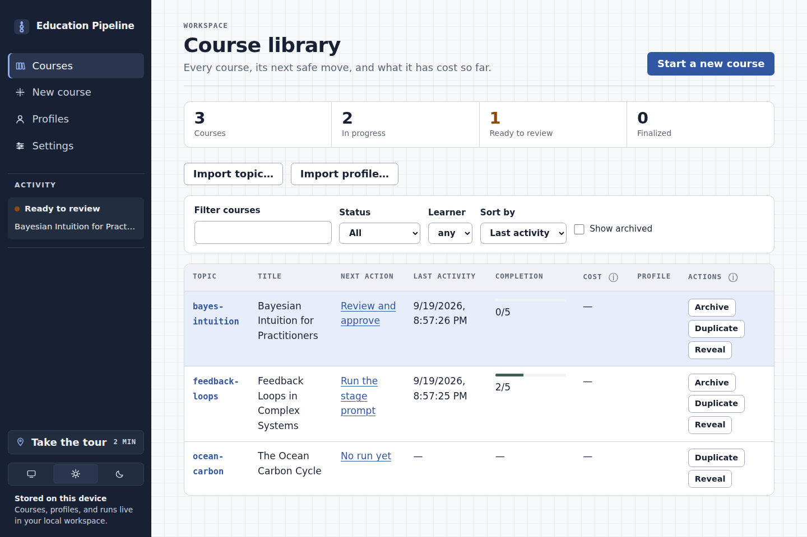
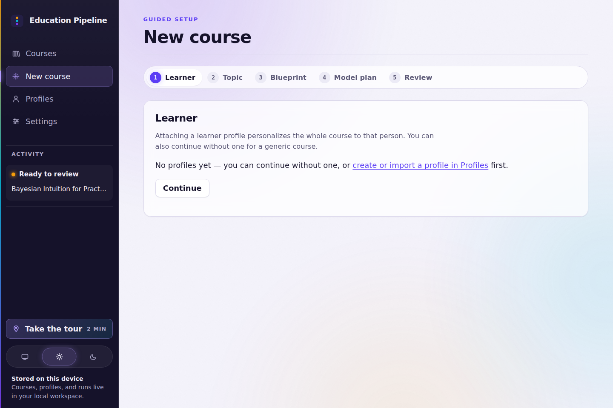
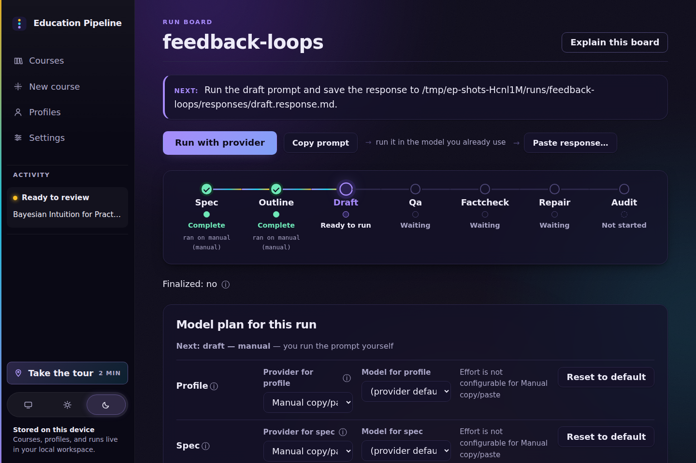
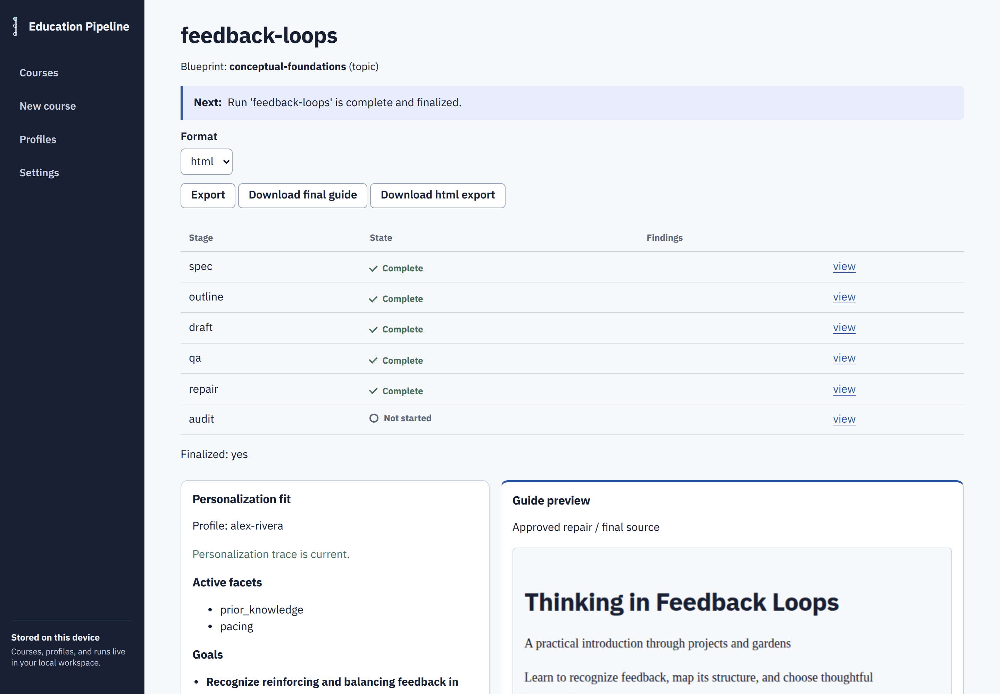
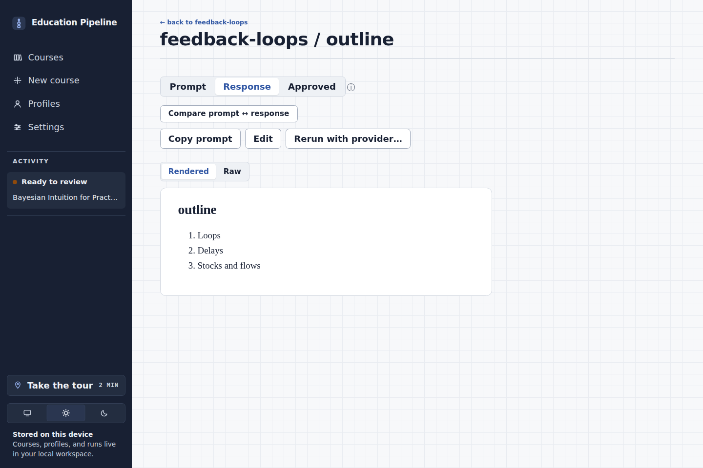
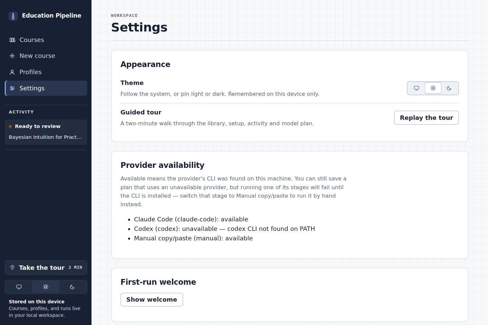
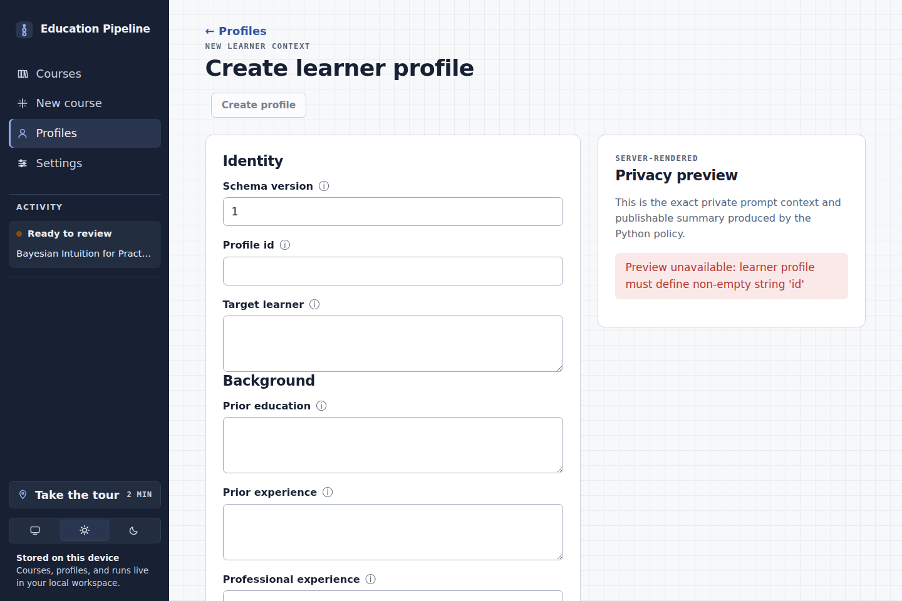
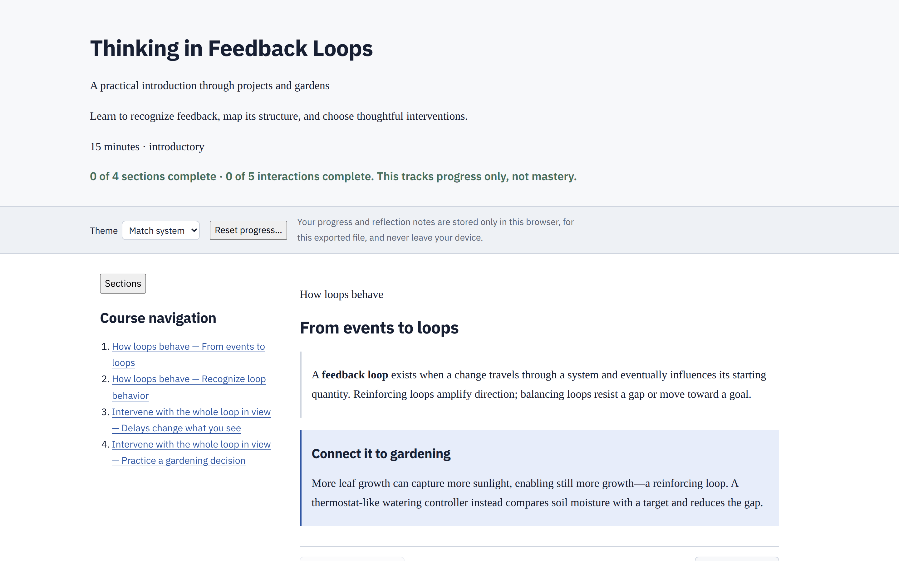
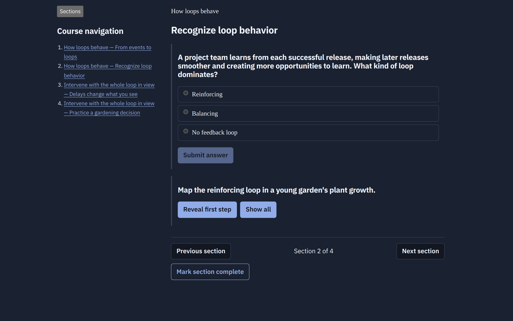

# education-pipeline

Build personalized, interactive, offline courses on your own machine —
with your choice of model doing the writing and you approving every step.

`education-pipeline` turns a topic, a learner profile, and a teaching
contract into a self-contained interactive HTML guide: modules, knowledge
checks, worked reveals, scenarios, reflections, and progress tracking in
one file that works offline from a `file:` URL. Models generate course
content only; the guide shell, runtime, design system, and validation
logic stay in maintained source code. Everything is local: plain files in
a workspace you own, no accounts, no telemetry, no hosted service.

**See one first:** open
[`examples/feedback-loops/export/guide.html`](examples/feedback-loops/export/guide.html)
in any browser — a complete synthetic example course, with every
intermediate artifact that produced it committed alongside in
[`examples/feedback-loops/`](examples/feedback-loops/).

## What it looks like

All screenshots show a demo workspace with synthetic courses and learners.

The **course library** is home base: every course with its next action,
completion, and attached learner. Everything lives in plain files on your
machine.



**New course** is a short guided sequence — learner, topic, pedagogical
blueprint, model plan, review. The blueprint step shapes what kind of
teaching the course does, with a recommendation explained in plain
language.



The **run board** drives a course through
`spec → outline → draft → qa → repair`. Each stage shows its state in
plain words; the next sound move is always the highlighted action.
Nothing advances without your approval.



Once a run completes, the run board becomes the quality record: validation
milestones, personalization fit against the attached learner profile, a
live guide preview, and one-click export.



The **stage viewer** shows each stage's prompt, response, and approved
artifact — with compare and diff views, in-browser editing, and provider
rerun.



**Settings** holds provider availability and the default per-stage model
plan: run every stage manually, through Claude Code or Codex, or mix
providers per stage.



**Learner profiles** personalize courses without leaking. Every field
carries a sensitivity marker, and the live privacy preview shows exactly
what reaches prompts versus what could ever reach a published guide.



The **exported guide** is a single offline HTML file: readable typography,
knowledge checks, worked reveals, scenarios, reflections, progress that
stays in the browser, and a built-in light/dark theme.





## Install

Python 3.11+ and a modern browser. No model provider required — every
stage can run manually.

```bash
# From a packaged release wheel (bundles the browser cockpit):
python3 -m pip install education_pipeline-<version>-py3-none-any.whl

# Or from a source checkout (cockpit needs a one-time asset build):
python3 -m pip install -e ".[dev]"
(cd web && npm ci && npm run build)
```

> **Keeping a source checkout current:** `git pull` updates the cockpit's
> *source*, not the built bundle the daemon serves. After any pull that
> touches `web/`, rebuild with `(cd web && npm run build)` — or launch
> with `education-pipeline ui --rebuild`. If you skip this, `ui` warns
> and the cockpit shows a banner. Release wheels bundle a prebuilt
> cockpit and never need this.

Installation is verified in CI on Linux, macOS, and Windows.

## Your first course

```bash
education-pipeline ui
```

One command resolves (or creates) your workspace, starts the local
loopback-only daemon, and opens the browser cockpit. From there, **New
Course** walks you through a topic, an optional private learner profile,
and a per-stage model plan; the course then moves through
`spec → outline → draft → qa → repair → finalize → export`, gated on your
approval at every stage.

The full walkthrough — including the terminal-only path — is in
[`docs/install-and-first-course.md`](docs/install-and-first-course.md).

## How it works

- **You stay in control.** Every model-powered stage writes its prompt to
  disk, waits for a response (from a provider run or your own
  copy/paste), and stops for your explicit approval. `advance` never
  auto-approves; a run can be resumed at any time from the workspace
  alone.
- **Models are pluggable.** Run stages through the Claude Code or Codex
  CLIs, mix providers per stage, or use any model manually. Availability,
  defaults, and per-stage overrides live in the cockpit's Settings and in
  editable TOML ([`docs/providers.md`](docs/providers.md)).
- **Quality gates are deterministic.** Schema, outcome-coverage, privacy,
  accessibility, and runtime checks produce reproducible reports; export
  refuses while blocking findings remain, and any waiver is recorded,
  reasoned, and hash-bound to the exact content. Every export ships a
  byte-reproducible `guide.report.json` sidecar
  ([`docs/interactive-guides.md`](docs/interactive-guides.md)).
- **Personalization is private by default.** Learner profiles tailor the
  course; their values are structurally absent from exports, which CI
  asserts against the shipped example
  ([`docs/privacy-and-local-trust.md`](docs/privacy-and-local-trust.md)).

## Documentation

| Doc | What it covers |
| --- | --- |
| [`docs/install-and-first-course.md`](docs/install-and-first-course.md) | Install to first exported course, cockpit and CLI paths |
| [`docs/providers.md`](docs/providers.md) | Provider install/auth, adapter behavior, model catalog and plan |
| [`docs/interactive-guides.md`](docs/interactive-guides.md) | Guide workflow, artifacts, validation findings and waivers, release gates |
| [`docs/privacy-and-local-trust.md`](docs/privacy-and-local-trust.md) | What stays local, the export boundary, daemon security model |
| [`docs/troubleshooting.md`](docs/troubleshooting.md) | Error-code reference and recovery actions |
| [`docs/backup-and-migration.md`](docs/backup-and-migration.md) | Workspace layout, backup, moving machines |
| [`docs/product-requirements.md`](docs/product-requirements.md) | Whole-product direction and roadmap |

## Command-line interface

The dependency-free CLI (`education-pipeline`, also
`python -m education_pipeline`) drives everything the cockpit does:
`topic`/`profile` management, `create`, `status`, `advance`, `approve`,
`validate`, `findings`, `report`, `waive`/`unwaive`, `finalize`, `export`,
provider `run`/`jobs`/`logs`, `workspace check --fix`, and `daemon`
control. Gate commands share a scriptable exit-code contract (`0` open,
`1` blocked, `2` usage error) — see
[`docs/troubleshooting.md`](docs/troubleshooting.md).

## Repository boundary

This is a public package repository. Generated runs, real learner
profiles, private topics, and tuned prompt libraries belong in your local
workspace, never here; CI enforces the boundary. The committed example is
fully synthetic. See [`docs/extraction-manifest.md`](docs/extraction-manifest.md).

## Development

```bash
python3 -m pip install -e ".[dev]"
python3 -m pytest                    # engine tests
(cd web && npm ci && npm test)       # cockpit unit tests
(cd web && npm run build)            # type-check + production build
(cd web && npm run e2e)              # Playwright acceptance
```

Development is strictly TDD; see [`CONTRIBUTING.md`](CONTRIBUTING.md) and
[`CLAUDE.md`](CLAUDE.md) for conventions.
